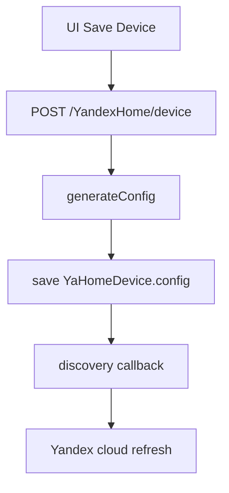
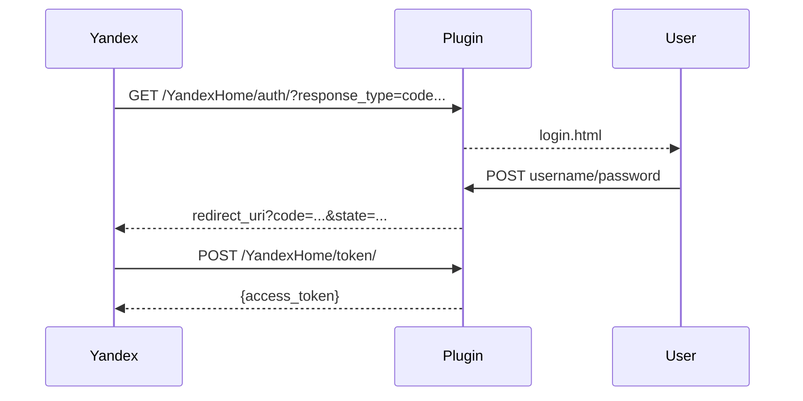

# YandexHome - Technical Reference

## Module Structure

| File | Purpose |
| --- | --- |
| `plugins/YandexHome/__init__.py` | Main plugin logic, admin UI, OAuth, Smart Home API, sync |
| `plugins/YandexHome/constants.py` | `devices_types` and `devices_instance` registries |
| `plugins/YandexHome/models/YandexHomeDevices.py` | SQLAlchemy device model `YaHomeDevice` |
| `plugins/YandexHome/forms/SettingsForm.py` | OAuth/skill settings form |
| `plugins/YandexHome/templates/yandexhome_main.html` | Main admin page (device list + settings modal) |
| `plugins/YandexHome/templates/yandexhome_device.html` | Vue-based device/capability editor |
| `plugins/YandexHome/templates/login.html` | OAuth login form |

---

## Data Model

Table: `yandexhome_devices`

| Field | Type | Purpose |
| --- | --- | --- |
| `id` | integer | Device ID (used as Yandex `id`) |
| `title` | string(50) | Device title |
| `type` | string(50) | Device type (`devices.types.*`) |
| `room` | string(50) | Room name |
| `description` | string(100) | Description |
| `manufacturer` | string(50) | Manufacturer |
| `model` | string(50) | Model |
| `sw_version` | string(50) | Software version |
| `hw_version` | string(50) | Hardware version |
| `capability` | text(JSON) | Internal capability mapping to object/property |
| `config` | text(JSON) | Ready Yandex response model for `/user/devices` |

---

## Device Lifecycle



`generateConfig(device)`:

1. Builds base device card (`id`, `name`, `type`, `room`, `device_info`).
2. Parses internal `capability` JSON.
3. For each instance computes:
- output group (`capabilities` or `properties`);
- output type (`devices.capabilities.*` or `devices.properties.*`);
- `parameters` (instance/range/modes/scenes/split);
- flags `retrievable` and `reportable`.
4. If `reportable=true`, registers object link through `setLinkToObject(...)`.

---

## Value Conversion

The module performs bi-directional mapping.

### osysHome -> Yandex (report_state)

Examples:

| Instance | Conversion |
| --- | --- |
| `on`, `mute`, `pause`, ... | `bool(value)` |
| `*_sensor` | `float(value)` |
| `motion_event`/`smoke_event`/`gas_event` | `detected` / `not_detected` |
| `water_leak_event` | `leak` / `dry` |
| `rgb` | `#RRGGBB` -> int |
| `open`, `volume`, `channel`, `humidity`, `brightness`, `temperature`, `temperature_k` | `int(value)` |

### Yandex -> osysHome (action)

Examples:

| Instance | Conversion |
| --- | --- |
| `on`, `mute`, `pause`, ... | `True/False` -> `1/0` |
| `motion_event`/`smoke_event`/`gas_event` | `detected` -> `1`, otherwise `0` |
| `water_leak_event` | `leak` -> `1`, otherwise `0` |
| `open_event` | `opened` -> `1`, otherwise `0` |
| `rgb` | int -> hex string without `#` |

> [!WARNING]
> Current `open_event` mapping is not symmetric: in `query`, value `1` is mapped to `closed`, while in `action` `opened` is written as `1`.

---

## OAuth Flow



Behavior details:

- Authorization `code` is stored in memory (`self.last_code*`).
- Authorization code TTL is about `10` seconds.
- Access token is stored in cache file (`saveToCache`) and remains valid until `unlink`.

---

## HTTP Routes

### Admin and Internal API

| Method | Path | Purpose |
| --- | --- | --- |
| `GET/POST` | `/admin/YandexHome` | Main module page and settings save |
| `GET` | `/YandexHome/types` | Returns translated `devices_types` and `devices_instance` |
| `GET` | `/YandexHome/device/<id>` | Fetch device for editor |
| `POST` | `/YandexHome/device` | Create device |
| `POST` | `/YandexHome/device/<id>` | Update device |

### OAuth and Smart Home API

| Method | Path | Purpose |
| --- | --- | --- |
| `GET/POST` | `/YandexHome/auth/` | OAuth authorize endpoint |
| `POST` | `/YandexHome/token/` | OAuth token endpoint |
| `GET` | `/YandexHome/` | Placeholder response |
| `GET/POST` | `/YandexHome/v1.0` | Health endpoint (`OK`) |
| `POST` | `/YandexHome/v1.0/user/unlink` | Unlink and revoke cached token |
| `GET` | `/YandexHome/v1.0/user/devices` | Device list |
| `POST` | `/YandexHome/v1.0/user/devices/query` | Current state query |
| `POST` | `/YandexHome/v1.0/user/devices/action` | Execute actions |

---

## Yandex Callback API Usage

Server-side calls:

- discovery callback:

```text
POST https://dialogs.yandex.net/api/v1/skills/<skill_id>/callback/discovery
Authorization: OAuth <client_key>
```

- state callback:

```text
POST https://dialogs.yandex.net/api/v1/skills/<skill_id>/callback/state
Authorization: OAuth <client_key>
```

- cloud device delete:

```text
DELETE https://api.iot.yandex.net/v1.0/devices/<device_id>
Authorization: Bearer <client_key>
```

---

## Search and Core Integration

- `actions = ["search"]` exposes plugin in global search.
- `search(query)` scans `title`, `description`, `capability`.
- `setLinkToObject`/`removeLinkFromObject` are used for reportable subscriptions.
- `changeLinkedProperty(obj, prop, value)` pushes state updates to Yandex callback API.

---

## Known Limitations

- Access token flow has no standard expiry/refresh token model.
- `request.user_id` is used as runtime context only.
- Deleting a device in UI also deletes it in Yandex cloud when `client_key` is configured.

---

## See Also

- [User Guide](USER_GUIDE.md)
- [Module Index](index.md)
