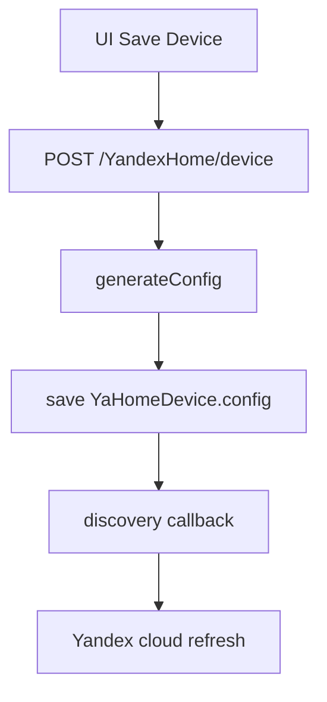
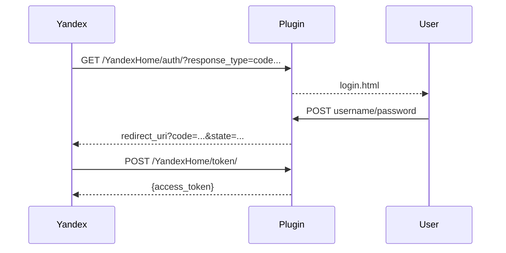

# YandexHome - Техническая документация

## Структура модуля

| Файл | Назначение |
| --- | --- |
| `plugins/YandexHome/__init__.py` | Основная логика модуля, UI, OAuth, Smart Home API, синхронизация |
| `plugins/YandexHome/constants.py` | Справочники `devices_types` и `devices_instance` |
| `plugins/YandexHome/models/YandexHomeDevices.py` | SQLAlchemy-модель устройства `YaHomeDevice` |
| `plugins/YandexHome/forms/SettingsForm.py` | Форма настроек OAuth/навыка |
| `plugins/YandexHome/templates/yandexhome_main.html` | Главная админ-страница (список устройств + настройки) |
| `plugins/YandexHome/templates/yandexhome_device.html` | Vue-редактор устройства и capability |
| `plugins/YandexHome/templates/login.html` | OAuth login-форма |

---

## Модель данных

Таблица: `yandexhome_devices`

| Поле | Тип | Назначение |
| --- | --- | --- |
| `id` | integer | ID устройства (используется как `id` в Яндекс payload) |
| `title` | string(50) | Имя устройства |
| `type` | string(50) | Тип устройства (`devices.types.*`) |
| `room` | string(50) | Комната |
| `description` | string(100) | Описание |
| `manufacturer` | string(50) | Производитель |
| `model` | string(50) | Модель |
| `sw_version` | string(50) | Версия ПО |
| `hw_version` | string(50) | Версия аппаратной части |
| `capability` | text(JSON) | Внутреннее описание привязок capability -> объект/свойство |
| `config` | text(JSON) | Готовая структура устройства для ответа Яндексу (`/user/devices`) |

---

## Жизненный цикл устройства



`generateConfig(device)`:

1. Формирует базовую карточку устройства (`id`, `name`, `type`, `room`, `device_info`).
2. Разбирает `capability` JSON.
3. Для каждого instance определяет:
- пойдет в `capabilities` или `properties`;
- итоговый `type` (`devices.capabilities.*` или `devices.properties.*`);
- `parameters` (instance/range/modes/scenes/split);
- флаги `retrievable` и `reportable`.
4. Если `reportable=true`, регистрирует связь через `setLinkToObject(...)`.

---

## Преобразование значений

Модуль выполняет двусторонние конвертации.

### osysHome -> Yandex (report_state)

Примеры:

| Instance | Преобразование |
| --- | --- |
| `on`, `mute`, `pause`, ... | `bool(value)` |
| `*_sensor` | `float(value)` |
| `motion_event`/`smoke_event`/`gas_event` | `detected` / `not_detected` |
| `water_leak_event` | `leak` / `dry` |
| `rgb` | `#RRGGBB` -> int |
| `open`, `volume`, `channel`, `humidity`, `brightness`, `temperature`, `temperature_k` | `int(value)` |

### Yandex -> osysHome (action)

Примеры:

| Instance | Преобразование |
| --- | --- |
| `on`, `mute`, `pause`, ... | `True/False` -> `1/0` |
| `motion_event`/`smoke_event`/`gas_event` | `detected` -> `1`, иначе `0` |
| `water_leak_event` | `leak` -> `1`, иначе `0` |
| `open_event` | `opened` -> `1`, иначе `0` |
| `rgb` | int -> hex-строка без `#` |

> [!WARNING]
> В текущей реализации `open_event` в `query` и `action` интерпретируется несимметрично: в `query` значение `1` мапится в `closed`, а в `action` `opened` пишется как `1`.

---

## OAuth поток



Особенности:

- `code` хранится в памяти (`self.last_code*`).
- TTL authorization code: около `10` секунд.
- Access token сохраняется в cache-файл (`saveToCache`) и валиден до `unlink`.

---

## HTTP маршруты

### Админ и внутренние API

| Метод | Путь | Назначение |
| --- | --- | --- |
| `GET/POST` | `/admin/YandexHome` | Главная страница и сохранение настроек |
| `GET` | `/YandexHome/types` | Возвращает `devices_types` и `devices_instance` (с переводами) |
| `GET` | `/YandexHome/device/<id>` | Получить устройство для редактора |
| `POST` | `/YandexHome/device` | Создать устройство |
| `POST` | `/YandexHome/device/<id>` | Обновить устройство |

### OAuth и Smart Home API

| Метод | Путь | Назначение |
| --- | --- | --- |
| `GET/POST` | `/YandexHome/auth/` | OAuth authorize endpoint |
| `POST` | `/YandexHome/token/` | OAuth token endpoint |
| `GET` | `/YandexHome/` | Заглушка "Your smart home is ready." |
| `GET/POST` | `/YandexHome/v1.0` | Health endpoint (`OK`) |
| `POST` | `/YandexHome/v1.0/user/unlink` | Отвязка и удаление access token |
| `GET` | `/YandexHome/v1.0/user/devices` | Список устройств |
| `POST` | `/YandexHome/v1.0/user/devices/query` | Текущее состояние |
| `POST` | `/YandexHome/v1.0/user/devices/action` | Выполнение команд |

---

## Callback API в Яндекс

Используются серверные запросы:

- discovery callback:

```text
POST https://dialogs.yandex.net/api/v1/skills/<skill_id>/callback/discovery
Authorization: OAuth <client_key>
```

- state callback:

```text
POST https://dialogs.yandex.net/api/v1/skills/<skill_id>/callback/state
Authorization: OAuth <client_key>
```

- delete cloud device:

```text
DELETE https://api.iot.yandex.net/v1.0/devices/<device_id>
Authorization: Bearer <client_key>
```

---

## Поиск и интеграция с ядром

- `actions = ["search"]` добавляет модуль в глобальный поиск.
- `search(query)` ищет по `title`, `description`, `capability`.
- `setLinkToObject`/`removeLinkFromObject` используются для подписок reportable.
- `changeLinkedProperty(obj, prop, value)` пушит обновления в Yandex callback API.

---

## Известные ограничения

- Access token не содержит стандартного срока жизни/refresh token.
- `request.user_id` используется как runtime-контекст и не хранится централизованно.
- Удаление устройства в UI сразу вызывает удаление и в облаке Яндекса (если заполнен `client_key`).

---

## См. также

- [Руководство пользователя](USER_GUIDE.ru.md)
- [Индекс модуля](index.ru.md)
